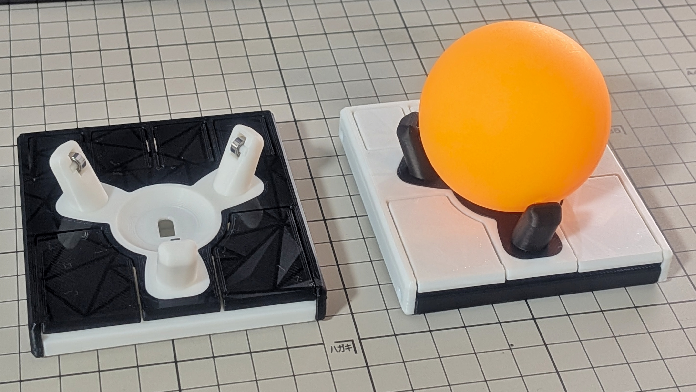
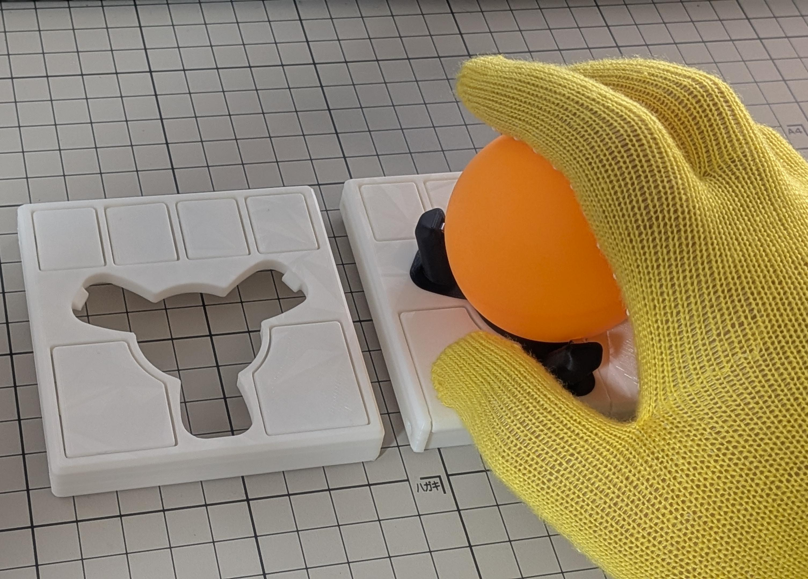

English | [日本語](README_ja.md)

> They say the trackball journey ends once you buy a Kensington SlimBlade Pro and an Elecom COMFY wrist rest.  
> But couldn't the case be made smaller?

# GOTOKU-55 Trackball

## What is this?
This is a **part** for a 55 mm trackball. To see where it fits, you need some background, in order.

### Ploopy Adept
The Adept is a trackball with a 44 mm ball (1.75 in ≈ 44.5 mm), developed by Ploopy, a small Canadian company. The design files and firmware are open source, but parts you source yourself may not fit dimensionally, so buying a kit or a fully assembled unit from the official Ploopy store is recommended.

- Link: [Adept Trackball](https://ploopy.co/adept-trackball/)

### Anyball
Adept Anyball is a mod project that reworks the Adept case so that the ball rides on BTUs (ball transfer units). By choosing a case variant, you can use anything from a small 34 mm ball up to a 68 mm billiard ball. The files are published on GitHub, and you 3D print and assemble them yourself.

There is of course a 55 mm version, but its supports sit low, so the ball sticks far out of the case and it is not very comfortable to use.

- Link: [Adept Anyball](https://github.com/adept-anyball/)

### small-btu v4 (Slim)
A compact case for 34 mm / 38 mm balls by Fabricio Bastian, published within the Anyball project. It is made as low-profile as possible so that it can sit between the halves of a split keyboard, and its design is beautiful and refined.  
Going by the height of the buttons alone, it is probably lower than the Keychron Nape Pro, one of the smallest trackballs on the market. If you like low-profile keyboards, it is very appealing.

- Link: [adept-anyball/ploopy-adept-small-btu](https://github.com/adept-anyball/ploopy-adept-small-btu)

### GOTOKU-55
Putting a 55 mm ball on small-btu v4 is quite a stretch. The ball itself is large, and arms built for BTUs become huge as well, so it would be almost unusable.  
So, to keep things compact, I made an arm part (the "trackball support" in small-btu terms) that holds a 55 mm ball on the same ball bearings Ploopy uses. That is GOTOKU-55. The name comes from *gotoku* (五徳), the pronged trivet that holds a pot over a Japanese gas burner, which is what the arm part looks like. The 55 is the ball diameter in millimetres.

In most cases the arm part is all you need. The small-btu v4 case is polished and beautiful, so you can use it as is.  
However, with a grip like mine, the stock v4 gets in the way: when I lay my thumb flat to press the front buttons, the corner of the case hits my finger.

So, for people who hold it this way, I also made a modified version that extends the front buttons all the way to the edge.  
The screw holes and so on are unchanged from v4, so printing only the top is enough, but the front wall disappears and it looks a little bare, so I made a bottom as well.

## Compatibility
small-btu v4 only.

v5 has a similar shape, so it might work, but by my estimate the ball would probably interfere slightly.

## How to build
See the [build guide](docs/BUILD.md).

## License
Copyright (C) 2026 Kotaro WAJIKI  
Based on ploopy-adept-small-btu v4, Copyright (C) Fabricio Bastian  
Licensed under the GNU General Public License v3.0
