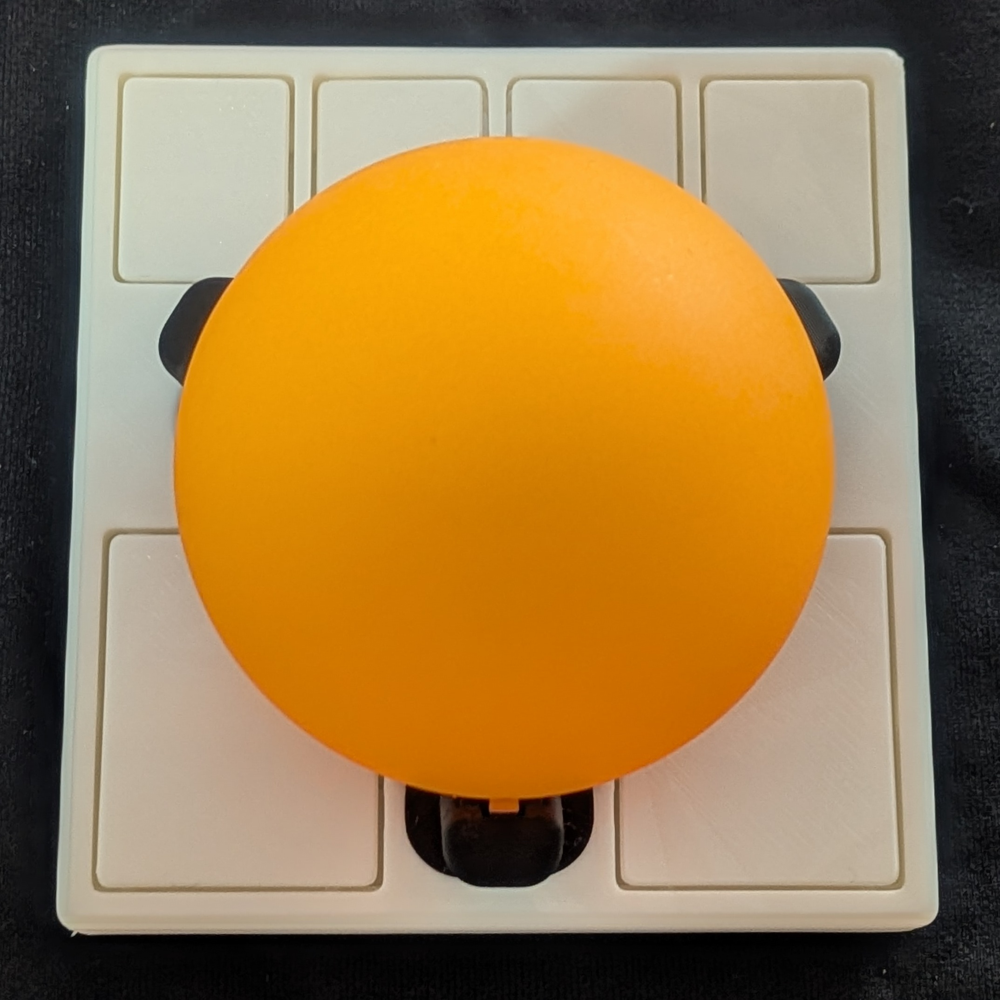
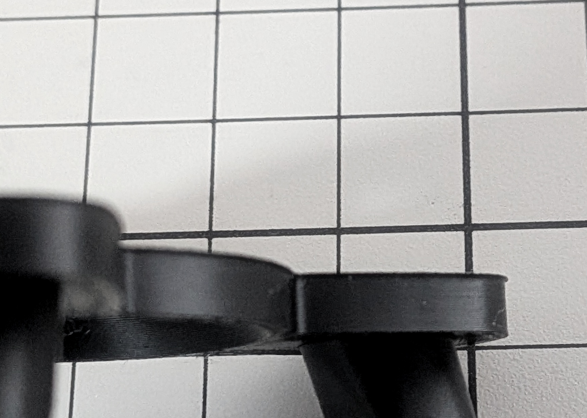

[English](BUILD.md) | 日本語

# GOTOKU-55 のつくりかた

## 必要なパーツ

### 電子部品
- [Ploopy Adept PCB](https://github.com/ploopyco/adept-trackball/tree/master/hardware/electronics)
- [ファームウェア](https://github.com/ploopyco/qmk_firmware)
- PMW3360 光学センサ
  - LM19-LSI レンズ
- USB-Cケーブル

電子部品についてはAdeptのキットを買えば揃います。

### 機械部品
- 55mm球
- M2x10mm 皿ネジ x4
- SMR63ZZ ボールベアリング x3

いきなり高価な55mm球を買うのを躊躇する場合は55mmの卓球練習用ボールが安価です。

ボールベアリングはステンレス製でないとすぐ錆びます。日本精工製がおすすめです。

### 3Dプリント品
- [ベアリング軸](https://github.com/ploopyco/classic-2-trackball/tree/master/hardware/mechanicals)
- [ベアリングはめこみ治具](https://github.com/ploopyco/classic-2-trackball/tree/master/hardware/mechanicals)
- [GOTOKU 腕](../3d-model/)
- 筐体トップ
  - [small-btu v4 筐体トップ](https://github.com/adept-anyball/ploopy-adept-small-btu/tree/main/v4)
  - [GOTOKU 筐体トップ](../3d-model/)
- 筐体ボトム
  - [small-btu v4 筐体ボトム](https://github.com/adept-anyball/ploopy-adept-small-btu/tree/main/v4)
  - [GOTOKU 筐体ボトム](../3d-model/)

3Dプリントは適切な向きで行う必要があります。基本的に大きな平面がプレート側です。

## 組立手順

### ベアリングの組立
治具を使ってベアリングに軸を押し込みます。このとき完全に中央に位置していなくても動作上おそらく影響はないです。

GOTOKU腕パーツにベアリングを押し込みます。押し込みには治具を使うと便利です。押し込んだ後滑らかに回転することを確認してください。

もし失敗した場合は精密ドライバーなどを隙間から差し込み、ベアリングを後ろから押し出せばやり直せます。

### ケースの組立
筐体トップにGOTOKU腕をはめ込みます。

嵌合がきつい場合はプリント時に底面が薄く突き出していないか確認してください。少しヤスリやカッターで整える必要があるかもしれません。

ボールの読み取りやボタンの押下に問題があればケースの調整が必要かもしれません。
3Dプリント品は何度もネジ止めできるほど強度が高くないのでネジ止め前に動作確認をしておきましょう。

### 結果報告
高価なトラックボール球は部屋の風景やあなたの顔が映り込む可能性があります。
SNSなどに製作したトラックボールの写真を投稿する際は事前に確認しておきましょう。